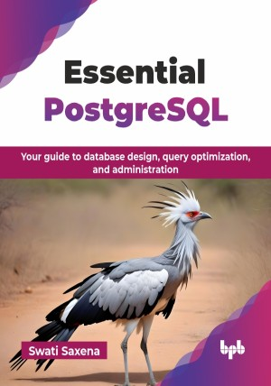

# Essential PostgreSQL

Your guide to database design, query optimization, and administration.

This is the repository for [Essential PostgreSQL
](https://bpbonline.com/products/essential-postgresql?variant=44260877336776),published by BPB Publications.

## About the Book
PostgreSQL, a robust and versatile relational database management system (RDBMS), is gaining immense popularity due to its reliability, scalability, and rich feature set. This book is your indispensable companion to mastering PostgreSQL, helping you become a great PostgreSQL developer and create amazing database-driven applications.

This book provides a thorough introduction to PostgreSQL, covering the fundamentals of database creation and management to advanced topics like data modeling, query optimization, and performance tuning. Explore PostgreSQL’s powerful features, including multi-version concurrency control (MVCC), data types, constraints, and indexing. Learn how to install, configure, and apply PostgreSQL in real-world scenarios. You will also develop essential SQL skills to manipulate and analyze data, design efficient schemas with normalization, and use stored procedures and triggers to automate tasks effectively.

By the end of this book, you will have a solid understanding of PostgreSQL's core concepts and best practices. You will be able to create complex database structures, write efficient SQL queries, optimize database performance, and implement robust data management strategies.

## What You Will Learn
• Database fundamentals like creation, structure, data types, and constraints.

• Data manipulation operations like insert, update, delete, retrieve, filter, and sort.

• Subqueries, joins and data formats for advanced data manipulation.

• Optimize database performance using indexes and views.

• Examine closely advanced topics like transactions, procedures, functions, triggers, and administration.
